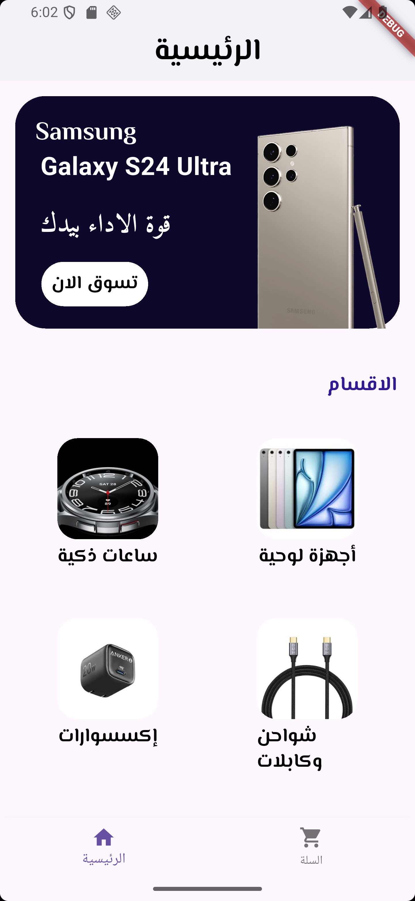
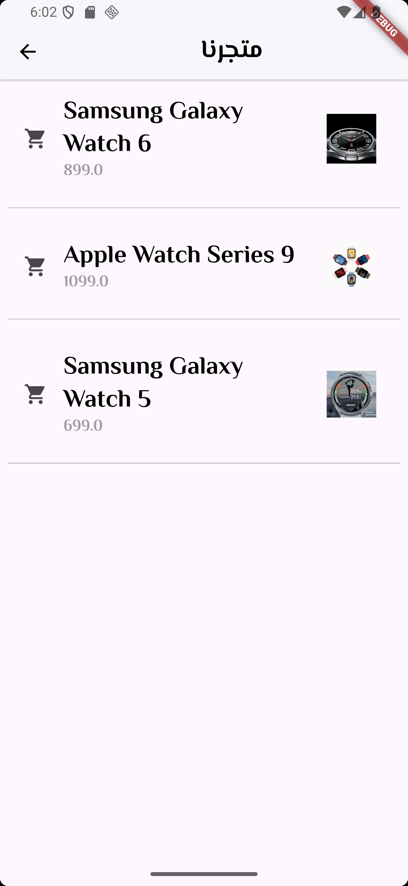
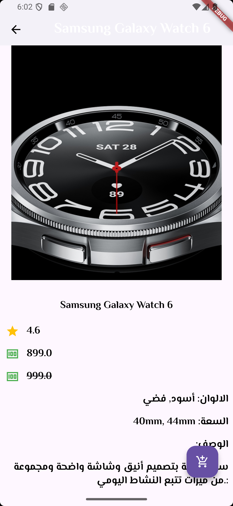

# 🛍️ Store App

<p align="center">
  <b>A modern and simple e-commerce mobile application built with Flutter.</b>
</p>


## 📱 About

**Store App** is a Flutter-based e-commerce application designed to provide users with a simple, clean, and enjoyable shopping experience.

The application allows users to browse different categories, explore products, view product details, and add products to their shopping cart.

The project focuses on building a clean user interface and practicing Flutter application development using reusable widgets and an organized project structure.

---

## ✨ Features

- 🏠 Modern Home Screen
- 📂 Browse Product Categories
- 🛍️ Browse Products
- 📱 View Product Details
- 🛒 Add Products to Cart
- 🧾 View Shopping Cart
- 🔄 Navigate Between App Screens
- 🎨 Clean and Modern UI
- ⚡ Smooth User Experience
- 📱 Responsive Flutter Layout

---

## 🖼️ Screenshots

<p align="center">
  
  
  
</p>

---

## 🛠️ Built With

| Technology | Description |
|------------|-------------|
| **Flutter** | Mobile application framework |
| **Dart** | Programming language |
| **Material Design** | UI and design components |
| **Android SDK** | Android development |

---

## 📂 Project Structure

```text
lib/
├── models/
│   ├── categories.dart
│   └── product.dart
│
├── screens/
│   ├── Cart_Screen.dart
│   ├── Home_Screen.dart
│   ├── Product_Screen.dart
│   ├── Show_Screen.dart
│   └── Tabs_Screen.dart
│
├── widgets/
│   ├── CategoryCard.dart
│   └── Show_Card.dart
│
├── app_data.dart
└── main.dart

screenshots/
├── CartScreen.png
├── MainScreen.png
└── ProductScreen.png
